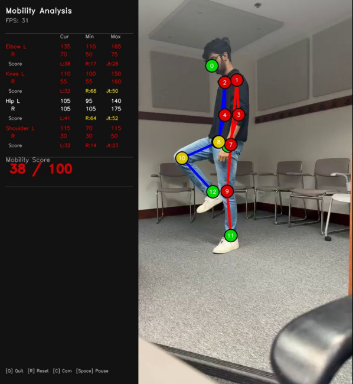
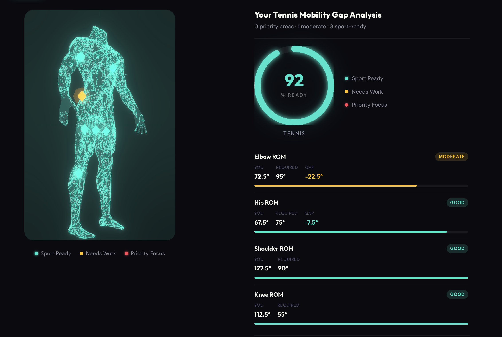
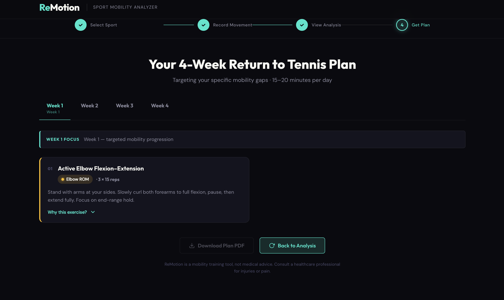

<!-- Slide 1: Title -->

# SNAPBACK

### **S**port-specific **N**euromuscular **A**nalysis and **P**ersonalized **B**lueprint for **A**thletic **C**omebac**K**

---

<!-- Slide 2: Problem Statement -->

## The Problem

 

Athletes returning to sport after a long break face a silent barrier — **they don't know what they've lost**.

 

- Mobility quietly declines during time away from sport
- Jumping straight back into training **dramatically increases injury risk**
- Generic recovery plans ignore individual deficits and sport-specific demands
- There is **no accessible, data-driven tool** to baseline movement before return

 

**Most athletes feel ready long before their body actually is.**

---

<!-- Slide 3: How It Works -->

## Three Steps Back to the Game

**① Choose Your Sport**
Select from basketball, football, tennis, golf and more. Each sport has a unique mobility blueprint — the exact joint ranges it demands.

**② Analyse Your Movement**
Stand in front of your camera. Our CV engine tracks 33 body landmarks in real time, measuring range of motion across 8 key joints — elbows, knees, hips and shoulders.

**③ Get Your Plan**
Receive a week-by-week exercise programme targeting _your specific deficits_ — not a generic warm-up, but a precision rehab plan matched to your sport.

---

<!-- Slide 4: The Technology -->

## Real-Time Mobility Analysis

 

A single webcam. No wearables. No clinic visit.

 

- **MediaPipe** detects 33 skeletal landmarks at 30 fps
- Joint angles computed live — elbow, knee, hip, shoulder (left & right)
- **EMA smoothing** removes jitter; session min/max tracks your true ROM

---

<!-- Slide 5: The Outcome -->

## From Deficit to Sport-Ready

 

SNAPBACK turns a 30-second scan into a recovery roadmap:

**The result:** a prioritised, sport-specific exercise plan — delivered instantly.
_Not "get fit". Get back._

---

<!-- Slide 6: Demo Screenshot -->

---

---

---

<!-- Slide 8: Thank You -->

# Thank You
